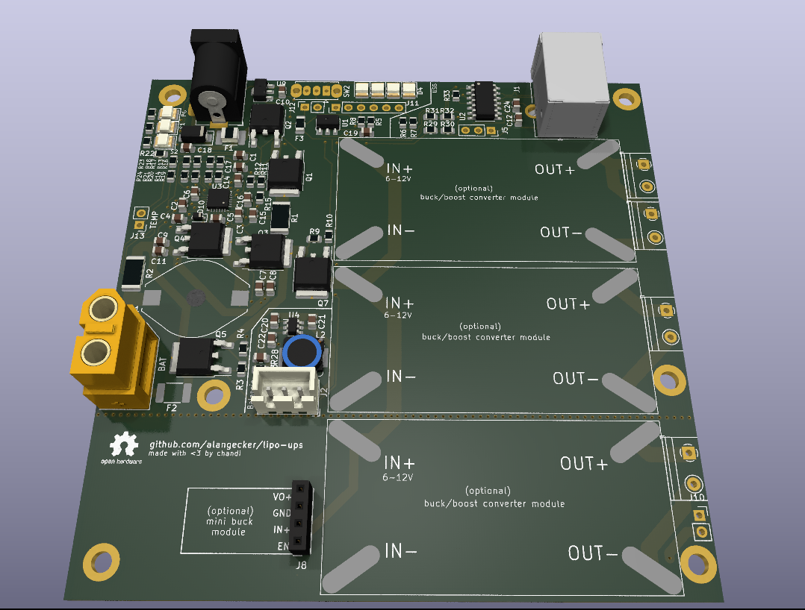

# LiPo UPS
a modular UPS utilizing any 2s LiPo Battery (e.g. for RC cars) 

**Status: draft! was not build & tested yet!**

## Features
- 50W output
- modular concept with off-the-shelf buck/boost converter modules for much flexibility
- read charging state via USB
- lots of battery protection features thanks to BQ24610
- "power path" design
- active balancing

## Specs
- Input: 9-12V and ≥6A

